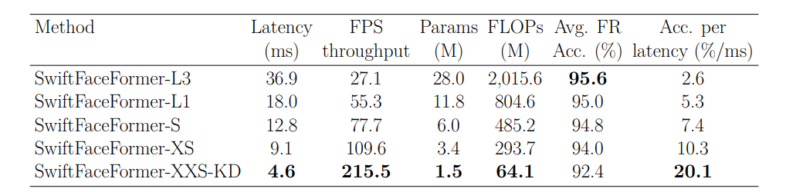
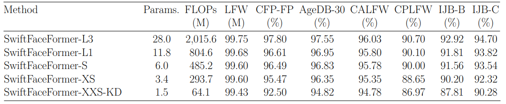

# SwiftFaceFormer: An Efficient and Lightweight Hybrid Architecture for Accurate Face Recognition Applications
Luis S. Luevano, Yoanna Martínez-Díaz, Heydi Méndez-Vázquez, Miguel González-Mendoza, Davide Frey

--------

This is the code repository release for the paper "SwiftFaceFormer: An Efficient and Lightweight Hybrid Architecture for Accurate Face Recognition Applications" accepted at the 2024 27th International Conference on Pattern Recognition (ICPR).

[](https://link.springer.com/chapter/10.1007/978-3-031-78341-8_16) [](https://lluevano.github.io/files/ICPR24_SwiftFaceFormer_poster.pdf)

<details>
<summary>Abstract</summary>
With the growing breakthrough of deep learning-based face recognition, the development of lightweight models that achieve high accuracy with computational and memory efficiency has become paramount, especially for deployment on embedded domains. While Vision Transformers have shown significant promising results in various computer vision tasks, their adaptability to resource-constrained devices remains a significant challenge. This paper introduces SwiftFaceFormer, a new efficient, and lightweight family of face recognition models inspired by the hybrid SwiftFormer architecture. Our proposal not only retains the representational capacity of its predecessor but also introduces efficiency improvements, enabling enhanced face recognition performance at a fraction of the computational cost. We also propose to enhance the verification performance of our original most lightweight variant by using a training paradigm based on Knowledge Distillation. Through extensive experiments on several face benchmarks, the presented SwiftFaceFormer demonstrates high levels of accuracy compared to the original SwiftFormer model, and very competitive results \hl{with respect to} state-of-the-art deep face recognition models, providing a suitable solution for real-time, on-device face recognition applications. Our code is available at https://github.com/Inria-CENATAV-Tec/SwiftFaceFormer
</details>

## Installation
```sh
$ conda env create -f environment.yml
```

## Inference
See [inference_example.py](inference_example.py) for details

## Model checkpoints
See [models/SwiftFaceFormer/](models/SwiftFaceFormer/) for all versions including:
- SwiftFaceFormer-L3
- SwiftFaceFormer-L1
- SwiftFaceFormer-S
- SwiftFaceFormer-XS
- SwiftFaceFormer-XXS-KD-L3

## Performance
### Latency performance on Nvidia Jetson Nano



### Expected accuracy performance



If you find this work useful for your research, please consider citing our work:

```bibtex
@InProceedings{10.1007/978-3-031-78341-8_16,
  author="Luevano, Luis S.
    and Mart{\'i}nez-D{\'i}az, Yoanna
    and M{\'e}ndez-V{\'a}zquez, Heydi
    and Gonz{\'a}lez-Mendoza, Miguel
    and Frey, Davide",
  editor="Antonacopoulos, Apostolos
    and Chaudhuri, Subhasis
    and Chellappa, Rama
    and Liu, Cheng-Lin
    and Bhattacharya, Saumik
    and Pal, Umapada",
  title="SwiftFaceFormer: An Efficient and Lightweight Hybrid Architecture for Accurate Face Recognition Applications",
  booktitle="Pattern Recognition",
  year="2025",
  publisher="Springer Nature Switzerland",
  address="Cham",
  pages="244--258",
  abstract="With the growing breakthrough of deep learning-based face recognition, the development of lightweight models that achieve high accuracy with computational and memory efficiency has become paramount, especially for deployment on embedded domains. While Vision Transformers have shown significant promising results in various computer vision tasks, their adaptability to resource-constrained devices remains a significant challenge. This paper introduces SwiftFaceFormer, a new efficient, and lightweight family of face recognition models inspired by the hybrid SwiftFormer architecture. Our proposal not only retains the representational capacity of its predecessor but also introduces efficiency improvements, enabling enhanced face recognition performance at a fraction of the computational cost. We also propose to enhance the verification performance of our original most lightweight variant by using a training paradigm based on Knowledge Distillation. Through extensive experiments on several face benchmarks, the presented SwiftFaceFormer demonstrates high levels of accuracy compared to the original SwiftFormer model, and very competitive results with respect to state-of-the-art deep face recognition models, providing a suitable solution for real-time, on-device face recognition applications. Our code is available at https://github.com/Inria-CENATAV-Tec/SwiftFaceFormer.",
  isbn="978-3-031-78341-8"
}
```

This repository is based on [lluevano/PocketNet-Custom](https://github.com/lluevano/PocketNet-custom).


## License

```
This project is licensed under the terms of the Attribution-NonCommercial-ShareAlike 4.0 
International (CC BY-NC-SA 4.0) license. 
Copyright (c) 2024 Luis Santiago Luévano García
```

--------
